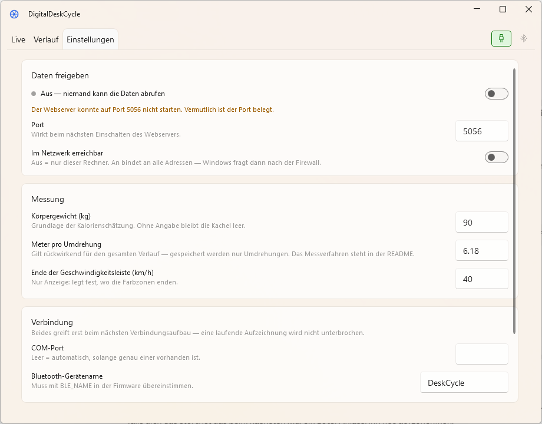

# DigitalDeskCycle

Tracks cadence, distance and training sessions of a desk bike. A Raspberry Pi
Pico 2 WH reads the reed switch the bike already has and reports the revolutions
to a Windows application.

> The user interface is in German — this is a personal tool for a specific bike.
> Everything else, including the reasoning in the code, is in English.

## Download

Grab a ZIP from the [latest release](https://github.com/JuliusFo/DigitalDeskCycle/releases),
unpack it and start `DeskCycle.Desktop.exe`.

| Package | Size | Needs |
|---------|------|-------|
| `…-win-x64-self-contained.zip` | ~87 MB | nothing else |
| `…-win-x64.zip` | ~19 MB | [.NET 10 Desktop Runtime](https://dotnet.microsoft.com/download/dotnet/10.0) |

Windows warns on first start

The packages are not code-signed, so SmartScreen steps in: *More info → Run
anyway*. A certificate costs money that a desk bike does not earn.

The sensor is a separate build — wiring, flashing and the checks are in
[`firmware/README.md`](firmware/README.md). Without one the application still
starts and shows both connection icons in red.

## The three views

**Live** shows what is happening now and sums up the period since the last
reset, like a trip meter. The button beside the tabs resets it; at a change of
day it asks rather than deciding on its own.

**Verlauf** (history) lists the individual sessions and the distance per day.

**Einstellungen** (settings) holds body weight, conversion factor, COM port,
Bluetooth name, the web server and the autostart entry. Changes take effect at
once where that is possible; where it is not, the page says so.

## First steps

1. **Enter your body weight** on the settings page — without it the calorie
   tile stays empty
2. **Check the conversion factor.** It is measured for one particular bike;
   another one needs [its own measurement](docs/accuracy.md)
3. That is it — a session starts by itself with the first revolution

The application lives in the tray. **Closing the window does not quit it**;
recording is meant to run all day. Quit through the tray icon.

Your data sits in `%LOCALAPPDATA%\DeskCycle`, deliberately away from the
program folder: the history survives an update, a reinstall or a moved
directory.

## Read on

| | |
|---|---|
| [How it works](docs/how-it-works.md) | USB against Bluetooth, what gets stored and why |
| [Configuration](docs/configuration.md) | every setting, and the web interface for other programs |
| [How accurate are the figures?](docs/accuracy.md) | the measured conversion factor, and why calories are an estimate |
| [Development](docs/development.md) | building, tests, releases, troubleshooting |
| [Changelog](CHANGELOG.md) | what changed per version |

## License

[MIT](LICENSE) — use it, change it, do what you like with it.

The firmware is measured against one particular reed switch on one particular
desk bike. The 200 ms debounce time and the conversion factor hold for that
setup; with different hardware the measurements change, while the reasoning
behind them still applies.
