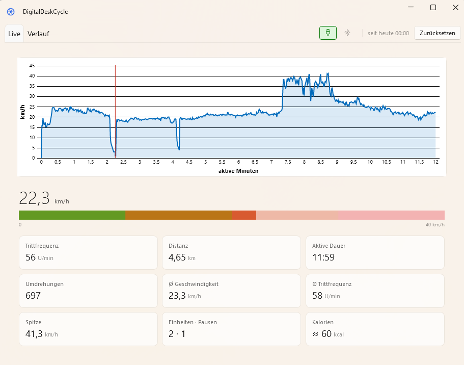
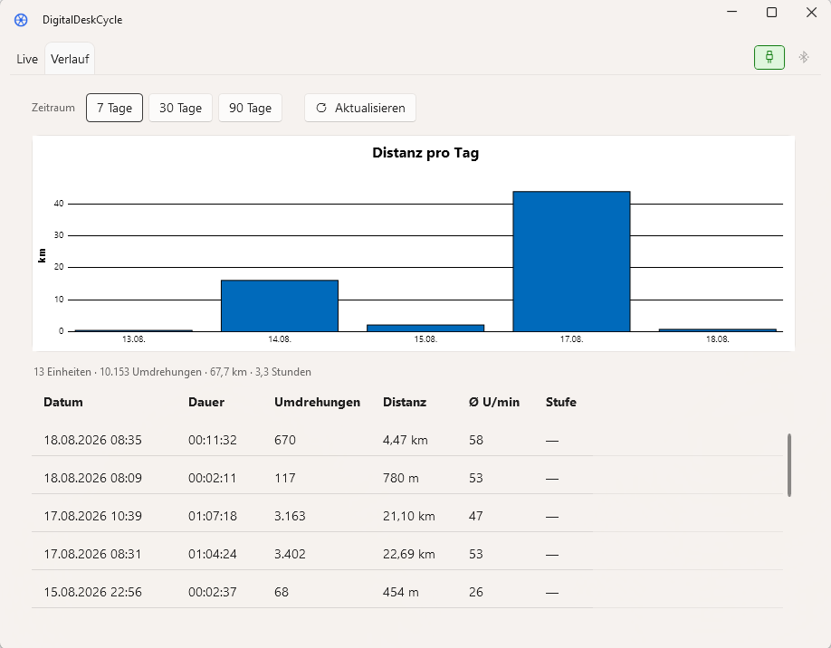

# DigitalDeskCycle

Tracks cadence, distance and training sessions of a desk bike. A Raspberry Pi
Pico 2 WH reads the reed switch the bike already has and reports the revolutions
to a Windows application.

> The user interface is in German — this is a personal tool for a specific bike.
> Everything else, including the reasoning in the code, is in English.



| Part | What it does |
|------|--------------|
| [`firmware/`](firmware/) | MicroPython on the Pico: counts pulses, debounces them, reports over USB **and** BLE |
| [`src/DeskCycle.Core/`](src/DeskCycle.Core/) | Capture, session detection, storage. Platform-neutral, no UI |
| [`src/DeskCycle.Desktop/`](src/DeskCycle.Desktop/) | WPF application: live view, history, tray icon |
| [`tools/`](tools/) | `Read-Cadence.ps1` — taps the COM port for troubleshooting |

## Download

Ready-built packages are attached to every
[release](https://github.com/JuliusFo/DigitalDeskCycle/releases). Unpack the ZIP
and start `DeskCycle.Desktop.exe` — `appsettings.json` belongs next to it, that
is where the COM port and the conversion factor live.

| Package | Size | Needs |
|---------|------|-------|
| `…-win-x64-self-contained.zip` | ~92 MB | nothing else |
| `…-win-x64.zip` | ~60 MB | [.NET 10 Desktop Runtime](https://dotnet.microsoft.com/download/dotnet/10.0) |

The packages are **not code-signed**. Windows shows a SmartScreen warning on
first start; *More info → Run anyway*. A certificate costs money that a desk
bike does not earn.

Without a sensor the application starts anyway and shows both connection icons
in red — useful for a look around, useless for training.

## Requirements

- .NET 10 SDK — only to build it yourself; the packages above need none
- Windows 10 version 2004 or newer
- For the firmware, see [`firmware/README.md`](firmware/README.md): wiring,
  flashing and the verification steps

## Running it

```bash
dotnet build DigitalDeskCycle2.slnx
dotnet run --project src/DeskCycle.Desktop
```

The application lives in the tray. **Closing the window does not quit it** —
recording is meant to continue throughout the working day. Quit through the
tray icon's context menu.

A session starts automatically with the first revolution and ends after 90
seconds of standstill. Sessions below 10 revolutions are discarded, so that a
pedal nudged in passing does not become a training session.

## The two views

**Live** (*Live*) summarises the period **since the last reset** — think trip
meter. Two ways to set it:

- The button beside the tab strip resets **to now**, for a deliberate fresh start.
- When the first revolution of a new day arrives while the statistics still run
  from yesterday, a bar appears and asks. Its button resets **to today at
  00:00**, so half an hour already ridden is not lost.

A reset deletes nothing. It only moves a timestamp in `settings.json`, which
makes it harmless to undo.

The time axis of the history chart is **active** time: interruptions of 30
seconds or more are taken out and marked with a red tick. The curve therefore
answers "how did I ride", not "when". On a desk bike used in bursts throughout
the day, a real time axis would consist mostly of idle.

**Verlauf** (*History*) shows individual sessions with date and wall-clock
duration. That this duration exceeds the active time in the live view is not a
contradiction — they answer two different questions.



## Where the data comes from

There are two sources. The application takes the first one that works:

1. **USB** (`SerialCadenceSource`) — reads the line-based output from the COM port
2. **Bluetooth** (`BluetoothCadenceSource`) — reads the standard
   *Cycling Speed and Cadence* profile

A running connection is never taken away **mid-session**: a change of source
resets the reference count — the two count different counters — and the
revolutions in between would be lost.

Between sessions it does switch, but only **towards** USB: while Bluetooth is
counting and nothing is being ridden, the application checks every five seconds
whether the serial port is back and then hands over. Without that, plugging the
cable back in would leave the radio link in charge until it drops of its own
accord. The other direction stays closed — whether the serial port exists costs
a look at a list, whether the bike is within radio reach would cost a scan next
to the running connection.

Which source is counting is shown by the two icons beside the tab strip, one for
USB and one for Bluetooth. The one delivering the samples is green and framed;
the other stays grey, because whether it *could* be used is unknown while
another connection is running. If nothing is connected, both turn red. The
tooltip names the source, e.g. `USB verbunden · COM3`.

### Why USB comes first

The CSC profile carries cumulative crank revolutions and a timestamp, nothing
else. The firmware's diagnostic counters — `bounce` and `suspect` — do not
exist there.

`suspect` counts pulses arriving implausibly close together and is therefore the
early warning for a bouncing or loose reed switch. When it rises, the sensor is
double-counting revolutions and **every** derived number is too high. Over USB
the interface warns about it; over Bluetooth it cannot.

That is why the counters are `null` rather than `0` when a source does not
provide them: a zero would look like a clean measurement that nobody took.

**Practical consequence:** as long as the Pico draws power from the computer,
the COM port exists too and USB always wins. Bluetooth only comes into play once
the Pico hangs off a charger or a power bank.

## Where the data lives

Everything under `%LOCALAPPDATA%\DeskCycle` — deliberately not next to the
executable, so that a rebuild or a moved program folder does not take the
history with it.

| File | Contents |
|------|----------|
| `deskcycle.db` | SQLite database with sessions and samples |
| `settings.json` | settings toggled at runtime |
| `logs\deskcycle-YYYY-MM-DD.log` | one file per day, older than 14 days are deleted |

## Configuration

### `src/DeskCycle.Desktop/appsettings.json`

Belongs to the program, read at startup.

| Key | Default | Purpose |
|-----|---------|---------|
| `Tracking:MetersPerRevolution` | `6.18` | distance per crank revolution — **measured**, see below |
| `Tracking:SerialPort` | empty | COM port; empty = automatic, as long as there is exactly one |
| `Tracking:BaudRate` | `115200` | must match the firmware |
| `Tracking:BluetoothDeviceName` | `DeskCycle` | must match `BLE_NAME` in the firmware |
| `Tracking:SessionIdleTimeoutSeconds` | `90` | no revolution for longer than this ends the session |
| `Tracking:MinimumSessionRevolutions` | `10` | shorter sessions are discarded |
| `Tracking:PauseThresholdSeconds` | `30` | a gap this long counts as a pause rather than a hiccup |
| `Tracking:SpeedGaugeMaxKmh` | `40` | upper end of the speed bar |

### `%LOCALAPPDATA%\DeskCycle\settings.json`

Belongs to the user, survives an update.

| Key | Default | Purpose |
|-----|---------|---------|
| `ApiEnabled` | `false` | web server for external consumers |
| `ApiPort` | `5056` | port of the web server |
| `ApiAllowRemote` | `false` | `false` = localhost only; `true` binds to the network and triggers the firewall prompt |
| `ResetAt` | today 00:00 | start of the period the live view summarises |
| `BodyWeightKg` | `0` | basis for the calorie estimate; `0` = not stated, then no figure is shown |

## Sharing data

Off by default. Switch it on with *Daten freigeben* (share data) in the tray
menu — while it is off, no socket and no listener exist.

| Endpoint | Returns |
|----------|---------|
| `GET /api/live` | current state |
| `GET /api/sessions?from=&to=&take=` | list of sessions |
| `GET /api/sessions/{id}` | one session including its samples |
| `GET /api/stats/daily?days=` | daily aggregates |
| SignalR `/hubs/cadence` | live push, message `Live` carrying a `LiveStatus` |

## Data model

What gets stored is **revolutions and timestamps**, never kilometres. Distance,
speed, calories and later watts are derived values.

The reason: for a long time the conversion factor was a rough estimate, and it
has just been replaced by a measured one. Every ride ever recorded became more
accurate at that moment, without anything being recalculated. Had kilometres
been stored, they would sit at the old estimate forever. The same goes for the
calories: change the body weight and every figure the application has ever shown
changes with it, because none of them was ever written down.

Samples are taken once per second, but **only while moving**. Seconds spent
standing still made up two thirds of the volume and added nothing that the
session itself does not already record; pauses fall out of the gaps between
timestamps when reading. Measured, a sample costs about 44 bytes, which is
roughly 39 MiB per year at an hour of movement per day.

The **resistance level** is invisible in the signal — the adjustment on the bike
is purely mechanical. It can be filled in per session (double-click a row in the
history). Nothing calculates with it yet: the calorie estimate below gets it
passed along and ignores it, because there is no calibration to turn a level
into watts. That measurement is what a power estimate is still waiting for.

## Calories

The live view shows a calorie figure, marked with `≈` because that is what it
is. It needs `BodyWeightKg` in `settings.json` — deliberately there and not in
`appsettings.json`, so that an update does not carry it off. Without it the tile
stays empty rather than showing a figure for an invented default person.

Behind it sits the usual MET formula — kilocalories per minute = MET × 3.5 × kg
÷ 200 — with the MET value interpolated from the cadence and the resting
metabolism subtracted: what is meant is what the riding costs on top of sitting
there.

**Where it falls down:** calories follow from mechanical power, and power is
exactly what this application cannot see. Sixty revolutions a minute against the
lightest resistance and against the heaviest are the same signal, and
energetically a multiple apart. Expect the figure to be off by anywhere up to
half — it is good for comparing one day against the next, not for a nutrition
plan.

Making it better means calibrating watts per resistance level. The model sits
behind [`IEnergyModel`](src/DeskCycle.Core/Statistics/IEnergyModel.cs) and every
call already passes the level along, so a measured model can take its place
without touching anything else.

## Tests

```bash
dotnet test DigitalDeskCycle2.slnx
```

[`tests/DeskCycle.Core.Tests`](tests/DeskCycle.Core.Tests/) covers the
arithmetic that decides what ends up in the database: the difference between two
counter readings including the Pico's restart, where a session begins and ends,
which ones get discarded, the pause threshold on the time axis, and the line
format from the firmware. Those are the places where a mistake stays invisible
the longest — the numbers still look plausible, they are simply wrong.

The calorie estimate is covered too, though differently: an estimate cannot be
pinned to a correct value, so the tests hold it to behaving sensibly — more
cadence and more time cost more, a pause earns nothing, twice the weight costs
twice as much, and one figure is nailed down as a check on the order of
magnitude.

The user interface is not covered; nor is anything that needs real hardware.

## Building a release

The [release workflow](.github/workflows/release.yml) builds both packages on a
tag and attaches them to the GitHub release:

```bash
git tag v1.0.0 && git push origin v1.0.0
```

Running it by hand from the Actions tab builds the same packages and keeps them
as workflow artifacts, without touching a release — useful for a dry run.

Locally, if it has to be:

```bash
dotnet publish src/DeskCycle.Desktop -c Release -r win-x64 --self-contained true -p:PublishSingleFile=true -p:IncludeNativeLibrariesForSelfExtract=true -p:EnableCompressionInSingleFile=true -p:DebugType=none -o publish/self-contained
```

## Changing the database schema

Migrations live in `src/DeskCycle.Core/Data/Migrations`. The EF tool is pinned
as a local tool in the repository (`.config/dotnet-tools.json`) rather than
installed globally:

```bash
dotnet tool restore
```

```bash
dotnet ef migrations add YourChangeName --project src/DeskCycle.Core --output-dir Data/Migrations
```

There is nothing to apply by hand — the application runs pending migrations at
startup. Databases created before migrations existed are detected and stamped
instead of being recreated.

## Troubleshooting

**Start with the log.** The application has no console; without the log file
every message disappears without trace. *Protokoll öffnen* (open log) in the
tray menu opens the folder. To follow along live:

```bash
Get-Content "$env:LOCALAPPDATA\DeskCycle\logs\deskcycle-2026-08-13.log" -Wait
```

**If the counting looks wrong**, ask the sensor directly. Quit the application
first — it holds the port — then run

```bash
.\tools\Read-Cadence.ps1
```

That shows `bounce` and `suspect` raw. What the values mean, and how the
debounce time follows from them, is in
[`firmware/README.md`](firmware/README.md).

**Only one program can hold the COM port.** Thonny, the capture script and the
application are mutually exclusive.

## The conversion factor

`Tracking:MetersPerRevolution` is `6.18` — measured on 2026-08-18, not
estimated. Seven readings a minute apart while pedalling to a metronome at 60
bpm, each one the distance covered in that minute divided by its 60
revolutions:

| Minute | 4 | 5 | 6 | 7 | 8 | 9 | 10 |
|--------|---|---|---|---|---|---|----|
| m per revolution | 6.111 | 6.333 | 6.111 | 6.190 | 6.250 | 6.111 | 6.160 |

Mean 6.181, median 6.160, standard deviation 0.085. At roughly 0.37 km a minute
and a display resolving 10 metres, each single value carries about 2.7 % of
reading error; averaged over seven of them some **±1 %** remains.

The value before it was 6.67 from a single reading over 45 revolutions, good to
about ±20 %. The measurement therefore moved every distance and speed in the
whole history down by 7.3 % — nothing was recalculated for that, because only
revolutions are ever stored.

To do it again, for another bike or another sensor:

1. Set a metronome to 60 bpm and pedal in time — with the Pico connected, check
   that the display really shows about 60 rpm
2. Plug the jack back into the original display unit, reset its trip counter
3. Read the distance once a minute and divide each minute's gain by 60
4. Average the readings and put the result into `appsettings.json`

Reading once a minute beats one reading at the end: it gives several
independent values whose scatter shows what the measurement is worth, instead
of a single number that could be off by a tick without anyone noticing.

## License

[MIT](LICENSE) — use it, change it, do what you like with it.

The firmware is measured against one particular reed switch on one particular
desk bike. The 200 ms debounce time and the conversion factor hold for that
setup; with different hardware the measurements change, while the reasoning
behind them still applies.
